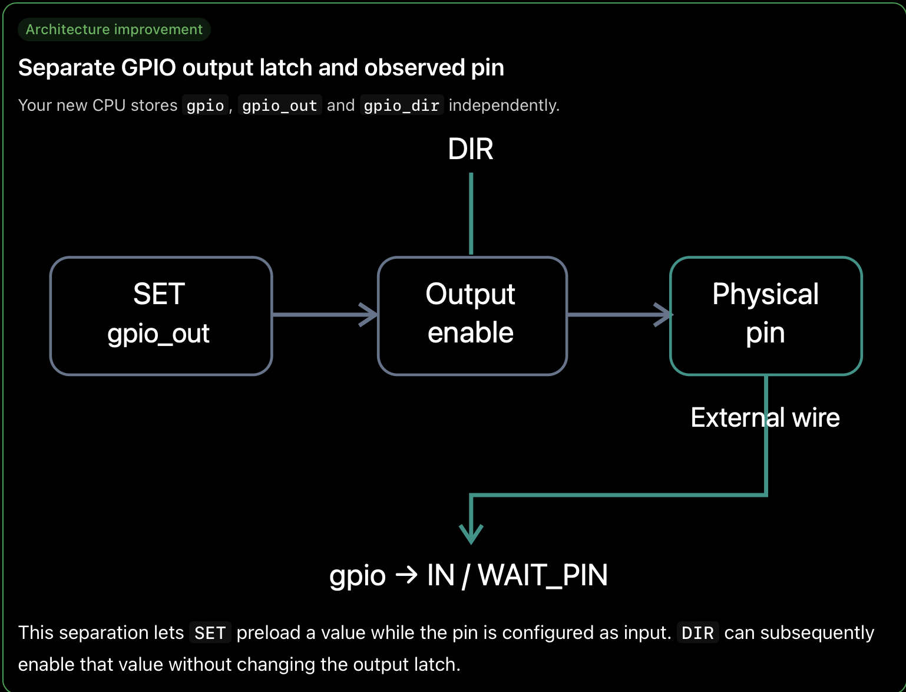

Program Memory
      │
      ▼
 ┌───────────┐
 │    PC     │  ← program counter
 ├───────────┤
 │ R0 ... R3 │  ← general registers
 ├───────────┤
 │ GPIO_OUT  │
 │ GPIO_DIR  │
 ├───────────┤
 │   CYCLE   │  ← protocol time
 └───────────┘

PC          8 bits
R0-R3       8 or 16 bits
GPIO        8 bits
GPIO_DIR    8 bits
cycle       integer
halted      boolean

Updatetd the GPIO arictecture to sepraatly store the GPIO results.

| Feature | Previous version | New version |
|---|---|---|
| GPIO model | One array for input and output | Separate output latch, direction and observed pin level |
| IN | Writes GPIO pin n into register bit n | Shifts left or right and inserts the sampled bit |
| WAIT_PIN | Waits for a specified logic level | Supports level, rising edge, falling edge, one-time check and timeout |
| Instruction timing | PC/cycle updates split between ISA and simulator | Each ISA instruction manages its own PC and cycle updates |
| Validation | Basic checks, some missing | Centralized operand validation and instruction syntax checks |
| Register width | Initially inconsistent | Consistent 32-bit masking |
| External simulation | Simple GPIO callback | Compatible with a separate cycle-accurate execution engine |
| Error handling | Primarily invalid operands | More explicit operand, timeout and signal-check errors |